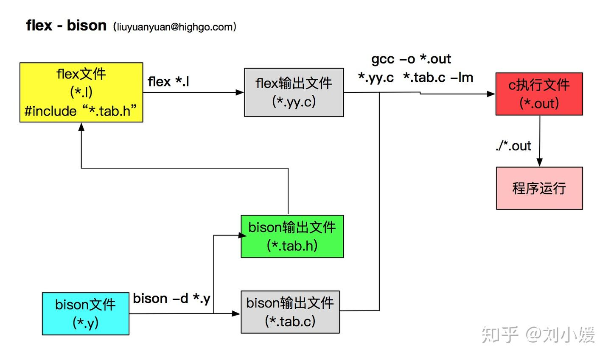

# 一. 内容结构
1. flex 文件结构
```
/* P1: declarations(定义段) */
%{
  
%}

%%
  /* P2: translation rules(规则段) */
%%

/* P3: auxiliary functions(用户辅助程序段，c函数)*/
```
2. Bison 文件结构
```
/*P1: declarations 定义段*/
%{

%}
 
%%
/*P2: grammar rules 规则段(rule-action)*/
    
     A: a1  {  语义动作1 }
	  | a2  {  语义动作2 }
	  | …
	  | an  {  语义动作n }
	  | b  //没有{…},则使用缺省的语义动作       
	; //产生式结束标记
    //语义动作一般是在产生式右部分析完，归约动作进行前执行。
    A→ a1 | a2 |  … | an | b 
%%

/* P3: supporting C routines 用户辅助程序段(C函数) */
```
# 二. Flex Bison 代码协作方式

# 三. 一些全局变量和函数
| 全局变量/函数  | 描述 |  
| ------------  | ----  |
| char *yytext  | 指向字符数组的指针，这个数组保存了当前匹配到的词法单元（token）的文本内容，可以通过访问yytext来获取刚刚识别出的词法单元的具体内容  |
| int yyleng    | 输入序列的长度 |
| int yylex()   | 词法分析驱动器的入口，扫描输入序列后，匹配到正则表达式(最长的那一条)，执行对应的C代码，返回代码段返回的值(代码段没写返回值yylex()默认返回0)，也就是每个token的标号。|
| int yywrap()  | 词法分析器分析结束时，自动调用yywrap()。如果其返回值为1，则结束分析过程；如果返回值为0，则继续扫描下一个输入。|
| YYSTYPE yylval | 默认是int，可以通过 %union 自定义。存储当前词法单元的属性值。例如，当Flex识别出一个整数或标识符时，它可以将这个数值或标识符的名字赋值给yylval |
| int yyparse() | 语法分析器函数，解析输入内容，并根据语法规则执行对应代码。返回值有三种:YYACCEPT(0)、YYABORT(1)、YYNOMEM(2)分别代表接受、语法错误、内存不足的情况。|
| void yyerror() | 错误处理，用户自定义 |
# 四. Bison 解析的流程（归约操作的先后顺序）
> 详细可以看中科大编译原理第六节，语法制导翻译的内容。   

Bison类的解析器一般用的语法分析算法是LR()算法，简而言之，面对一串由 Flex 得到的 token 序列，Bison 归约的顺序是：从左至右依次扫描，自底向上归约。  
例子: 
```
int main(){return 0;}

按照如下的 BNF 进行语法分析：
// CompUnit  ::= FuncDef;

// FuncDef   ::= FuncType IDENT "(" ")" Block;
// FuncType  ::= "int";

// Block     ::= "{" Stmt "}";
// Stmt      ::= "return" Number ";";
// Number    ::= INT_CONST;

归约的顺序是：
		归约操作							token 序列
int 					-> FuncType	: FuncType main() {return 0;}
Number								: FuncType main() {return Number;}
return Number; 			-> Stmt		: FuncType main() {Stmt}
{Stmt}		   			-> Block	: FuncType main() Blcok
FuncType main() Blcok 	-> FuncDef 	: FuncDef
FuncDef					-> CompUnit : CompUnit

简单理解为，从左至右依次找到能完整归约的第一个表达式
```

